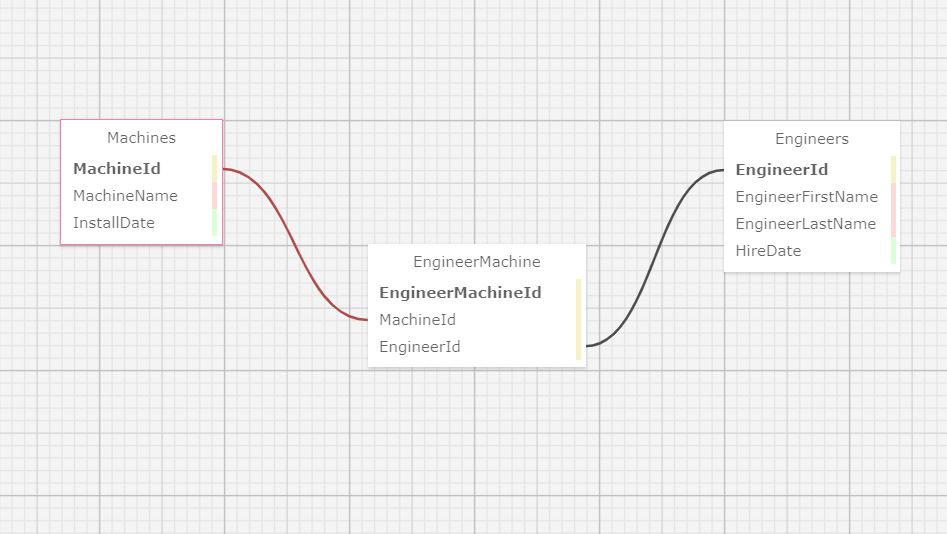

# Factory Database

#### A website for a factory to mange its hired engineers and the machines they service, 1/8/21

#### By Eric Endsley

## Description

This is a simple MVC website meant for a factory to input and manage information regarding employed engineers and the machines that they are licensed to service. The homepage displays two lists, one list of all the factory's engineers, and one list of all the factory's machines. The items in these lists are links to the details page which displays more information about an engineer or machine, including which engineers may service which machines. These detail pages also include the option to either add a new licensed engineer to a machine, or add a machine license to an engineer. Adding the machine-engineer relationship on either end (engineer or machine) will update the database and cause that relationship to display on the corresponding details page as well.

The user is also able to navigate to pages which host only a single list of engineers or machines. These lists are likewise links to corresponding details pages. The engineer list on this page is alphabetized by engineer's last name. On the engineer & machine directory pages, additional functionality is in place so that the user may add a new engineer or machine to the directory. The site also includes a navbar to move throughout some of the top-level pages on the site.

## Data Relationships

## Setup

#### Install .NET Core

1. This program is written in C# and requires the .NET Core to run. For PC users click [this link](https://dotnet.microsoft.com/download/dotnet-core/thank-you/sdk-2.2.203-windows-x64-installer) and follow the installation instructions. For Mac users click [this link](https://dotnet.microsoft.com/download/dotnet-core/thank-you/sdk-2.2.106-macos-x64-installer) and follow the installation instructions.

2. Install dotnet script by entering the following command in your terminal: "dotnet tool install -g dotnet-script"

#### Install MySQL

1. This program uses MySQL to store and manage data. Navigate to [this link](https://dev.mysql.com/downloads/file/?id=484919) and follow the installation instructions to install MySQL and MySQL Workbench.

2. Be sure to make note of the password you create during the installation process, you will need to use this later on in the setup.

#### Clone The Repository

1.  Open the [Factory Database website](https://github.com/eric-endsley/week-10-project.git) by clicking the link or copy/pasting "https://github.com/eric-endsley/week-10-project.git" in the navigator bar of a web browser application.

2.  Click the green Code button in the upper-right part of the window and then EITHER:

3.  a. Copy the HTTPS URL for the repo and use it in the git clone command in git-bash or another git terminal by inputting: "git clone https://github.com/eric-endsley/week-10-project.git" 
    OR b. Click "Download Zip" and unzip the file to an accessible location on your machine.

4.  Right click on the project directory and open it with VS Code or another code editor.

#### Setup MySQL Database with Entity

1. Navigate to the appsettings.json file within the /Factory subdirectory. Locate the line of code that states "pwd=epicodus" and overwrite epicodus with the password you created during installation of MySQL

2. In your terminal, type the command "dotnet restore" followed by the command "dotnet ef database update". You have now created the data structure for this application.

3. Open the program MySQL workbench which you installed earlier, enter the password that you setup during installation.

4. Using the navigation bar select Server > Data Import.

5. When prompted, select the option to "Import From Self Contained File" and select the file "eric_endsley_Db_export.sql" in the Factory.Solution folder.

6. In the dropdown labelled "Default Target Schema:", select "eric_endsley" or whatever you named your database in appsettings.json. Select all of the schema objects. Then click the "Start Import" button.

#### Open the Webpage!

1. In the terminal, type the command "dotnet run".

2. If your browser does not automatically open the page, open your preferred browser and enter "http://localhost:5000" in the navigation bar. If this does not work, look for the phrase "Now listening on:" written in your terminal a few lines after your "dotnet run" command. Navigate to the url written there.

## Technologies Used

C#, .NET Core 2.2, ASP.NET Core MVC, MySQL, Entity Framework Core, Razor, Bootstrap, VS Code

## Known Bugs

None

## Contact Information

To ask questions or report a bug, contact [Eric Endsley](mailto:eric.endsley4@gmail.com)

## Legal

This software is licensed under the MIT license.
